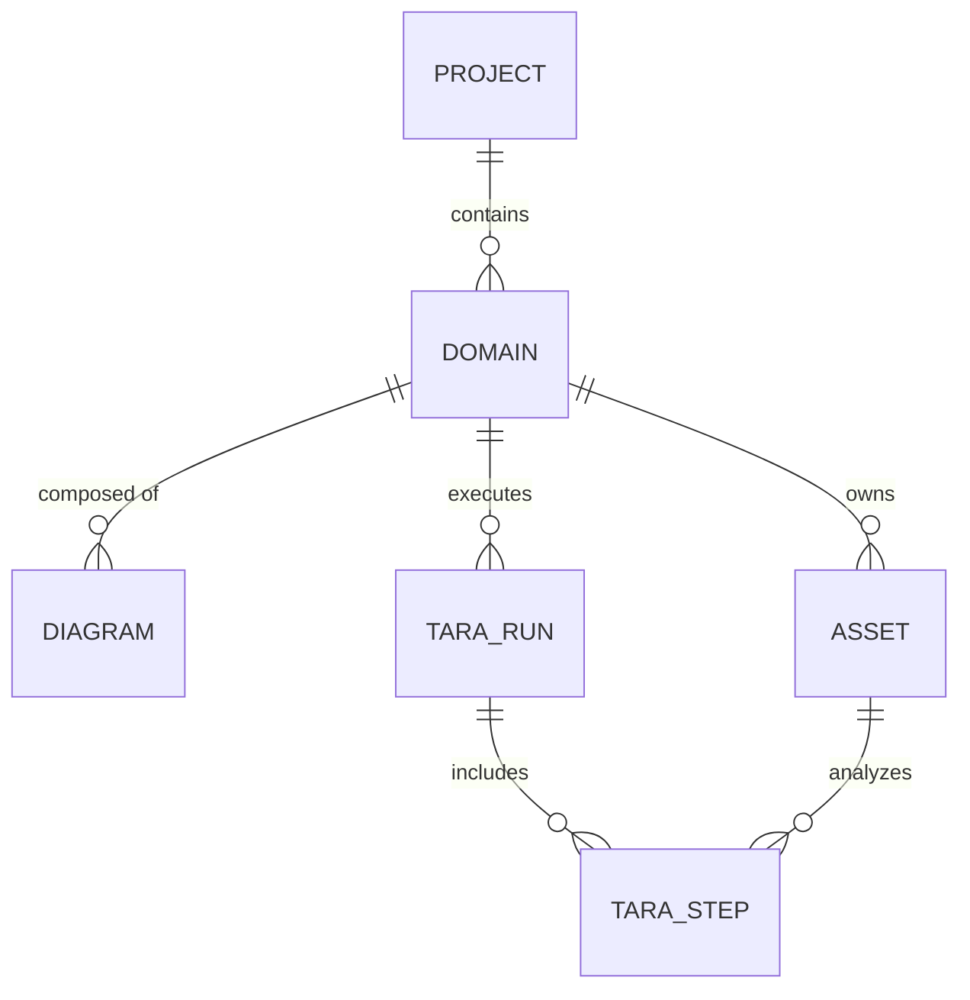

# TARA AI 分析平台需求规约深度解析

本文档根据 `/home/ubuntu/tara-ai-platform/docs/requirements-frozen.md` 中定义的 **TARA AI 平台 (v3 冻结版)** 整理而成，集中展现系统的业务流程、实体模型以及所有核心业务规则。

---

## 1. 业务工作流总览

TARA 分析平台面向的是一个协作性强、规范度高的汽车网络安全分析流程：

```mermaid
graph TD
    Start([开始项目]) --> CreateProj[1. 创建/配置项目]
    CreateProj --> CreateDomain[2. 录入子域控]
    CreateDomain --> CreateDFD[3. 绘制功能图 DFD]
    
    subgraph DFD_Canvas [功能图与资产阶段]
        CreateDFD --> EditCanvas[手工/AI 辅助画图]
        EditCanvas --> ExtractAsset[点击【提取资产】]
        ExtractAsset --> Deduplicate[AI 去重与专家核对]
    end

    Deduplicate --> ValidateStart{是否至少有1个已确认资产?}
    ValidateStart -- 否 --> Deduplicate
    ValidateStart -- 是 --> RunTARA[4. 启动 TARA 分析]

    subgraph TARA_Engine [TARA 5阶段分析 - 异步锁定]
        RunTARA --> S1[阶段①: 安全属性分析]
        S1 --> S2[阶段②: 损害场景与影响评估]
        S2 --> S3[阶段③: 威胁场景与可行性评估]
        S3 --> S4[阶段④: 风险处理决策]
        S4 --> S5[阶段⑤: CSR/CSO 生成]
    end

    TARA_Engine --> OnlineReview[5. 在线报告审阅与人工确认]
    OnlineReview --> FinalizeReport[6. 汇总与生成报告]
    FinalizeReport --> Archive[7. 归档冻结 (只读)]
    Archive --> Export[8. 导出 XLSX/DOCX (支持脱敏)]
    Export --> End([结束流程])
```

---

## 2. 实体关系模型 (ERD)

系统包含以下 8 个核心业务实体及其关联关系：



### 数据模型定义

1. **项目 (projects)**
   - 唯一标识、项目名称 (50字上限)、项目描述 (200字上限)、项目状态 (草稿 / 进行中 / 已完成)、创建时间、更新时间。
2. **子域控 (domains)**
   - 唯一标识、所属项目标识、子域控名称 (50字上限)、分析进度 (0~100)、当前分析状态 (未开始 / 分析中 / 已完成 / 分析失败)、创建时间、更新时间。
3. **功能图 (diagrams)**
   - 唯一标识、所属子域控标识、功能图标题 (100字上限)、版本号 (用于编辑冲突校验)、画布结构数据 (节点列表与连线边列表)。
4. **资产 (assets)**
   - 唯一标识、所属子域控标识、来源功能图标识 (允许为空)、资产名称 (100字上限)、资产类型 (数据 / 软件 / 硬件 / 通信)、使用的通信协议、备注描述、确认状态 (待核对 / 已确认 / 已拒绝)、创建时间、更新时间。
5. **TARA 运行记录 (tara_runs)**
   - 唯一标识、所属子域控标识、分析运行状态 (排队中 / 分析中 / 已完成 / 已失败 / 已取消)、分析进度 (0~100)、运行发起时间、运行完成时间。
6. **TARA 分析步骤 (tara_steps)**
   - 唯一标识、所属运行记录标识、对应的分析阶段、所属资产标识、该步骤状态 (排队中 / 分析中 / 已完成 / 已失败)、输入特征哈希 (用于判断增量分析与断点续跑)、该阶段的分析结论 (包含 AI 原始输出、人工修改标记以及修改原因)、失败原因、当前重试尝试次数、开始时间、完成时间。
7. **全局配置 (system_settings)**
   - 唯一标识、AI 接口地址、AI 接口凭证、大模型名称。
8. **用户账户 (users)**
   - 唯一标识、用户登录名、登录密码加密凭证、角色类型 (系统管理员 / 安全分析员)、创建时间。

---

## 3. 核心业务规则汇总

### 3.1 项目与子域控管理
*   **项目状态推导 (BR-03)**：有子域控在“分析中”时，项目状态自动变为`进行中`；所有子域控分析均标记为“已完成”时，项目状态变为`已完成`；其余情况为`草稿`。
*   **归档冻结 (BR-78)**：项目状态变为`已完成`后，该项目下所有数据强行只读（不能重新分析、修改结果或编辑画布）。若需修改，须由管理员手动解除归档恢复为`进行中`。
*   **删除级联 (BR-04, BR-09)**：删除项目/子域控时级联删除其下所有子域控、功能图、资产、分析记录。
*   **分析运行保护 (BR-10)**：子域控状态为“分析中”时，禁止对其执行任何修改操作以防止分析数据失真。

### 3.2 功能图 (DFD) 与资产提取
*   **画布数据结构 (BR-13)**：画布必须表达节点列表（唯一标识、类型 [支持 entity, process, storage, interface, boundary]、位置、名称、功能描述、协议、备注）与连线边列表（连线名称、源节点和目标节点、传输信息）。新引入的 `interface` 节点用于表示物理/调试接口。
*   **页面布局规范**：为防止页面在包含大量功能图 (例如 15+ 个 DFD) 时向下无限拉长导致资产表格不可见，工作台页面强制约束在固定视口高度内（如 `calc(100vh - 64px)`），功能图卡片网格区域与资产列表区域各自设定 Flex 弹性比重并支持区域内部独立滚动。
*   **并发保护 (BR-16)**：当两个用户同时保存同一个画布时，系统必须阻止后保存用户的提交，并弹出冲突提示。
*   **自动保存与容灾 (BR-17)**：用户停止编辑 2 秒后自动保存；网络断开时修改暂存在本地浏览器中，恢复后自动同步。
*   **资产提取与去重 (BR-25, BR-29, BR-33, BR-35)**：
    *   通过解析节点与连线映射资产。再次提取时，系统清空“待核对”旧资产，但保留已由人工“确认”或“拒绝”的资产。
    *   **节点与资产映射逻辑**：`entity` 节点映射为硬件资产或外部组件；`process` 节点映射为软件资产；`storage` 节点映射为数据存储资产；`interface` 节点映射为硬件资产。
    *   **去重隔离原则**：AI 辅助去重仅限子域控内部，且**禁止跨 DFD 节点类型合并**。即使名称或描述非常相似，不同的节点类型（如微控制器主体 `MCU` [entity] 及其调试接口 `MCU_JTAG` [interface]）必须绝对独立保留，禁止自动合并，以防破坏逻辑拓扑结构。去重建议确认后，建议删除的资产状态设为“已拒绝”以保留历史轨迹。
*   **编辑排他锁 (BR-72)**：任一分析员编辑画布、核对资产或修改分析结果时，页面自动锁定，其他成员访问时进入只读模式并提示编辑者姓名。停止操作或离线超过 5 分钟自动解除。

### 3.3 TARA 分析与结果审阅
*   **启动校验 (BR-36, BR-37)**：仅已确认资产可进入分析，子域控下必须至少有 1 个已确认资产才允许启动分析。
*   **5阶段分析与结构化保存 (BR-40, BR-41)**：①安全属性分析 -> ②损害场景与影响评估 -> ③威胁场景与攻击可行性 -> ④风险处理决策 -> ⑤CSR/CSO生成。每步结论以结构化数据保存。
*   **增量分析与断点续跑 (BR-45)**：系统只针对资产或输入发生改变的步骤进行重新分析。已完成且输入参数未变的步骤，不再重复调用 AI，以实现增量分析并节省计算开销。
*   **人工修改标记与继承 (BR-51, BR-75)**：
    *   人工修改将直接覆盖 AI 草案结论，系统必须打上“人工修改”的永久印记并记录修改原因。
    *   重新分析时，若资产属性和依赖前置分析未变，自动继承上一轮的人工确认结论。
*   **风险决策联动 (BR-69)**：若用户人工修改风险决策为“接受风险”或“转移风险”，系统在第⑤阶段自动免除该威胁场景的 CSR 生成。
*   **多路径聚合与降级 (BR-67, BR-70)**：
    *   同一个威胁场景包含多条攻击路径时，最终攻击可行性等级由其所有关联路径中可行性等级最高（最易发生）的一条决定。
    *   在网络或 AI 故障时，允许直接手动创建并确认所有阶段的分析结论。
*   **中英文对照输出 (Bilingual Output)**：为符合国外评估标准与审计合规性，系统大模型的所有描述性文本（包括损害场景、威胁场景、攻击路径、决策理由、CSO安全目标与CSR需求等）及系统离线降级填充数据，必须统一以中英双语对照格式输出，固定格式为“中文 / English”。
*   **Excel 对齐与项目级控制矩阵**：全新设计与导出的平铺 Excel 列完全对齐的“TARA 评估详情表”与由 7 列构成的“项目级安全控制要求矩阵”看板，支持行内多语言一键切换。
*   **全字段行内修订与整行增删同步**：安全专家可以直接在表格中对所有字段（如损害场景描述、各项安全/运营/隐私打分、可行性参数、处置决策、网络安全控制措施及安全要求内容等）进行修改，支持新增或整行快捷删除，更改在保存时原子化写入评估库。
*   **CAF Level 专家手动标定覆盖与大小写容错**：自动基于可行性等级（AF Level）联动计算风险值，并且允许专家下拉标定和覆盖（Calibration Override）最终的 CAF Level。对可行性等级输入的大小写自动进行规范化处理（如把 `'Medium'` / `'medium'` 转化为统一表示），防止数据渲染和判定错乱。
*   **内容哈希唯一 ID 机制 (BR-80)**：安全声称 ID (`CLM_` + Hash)、安全目标 ID (`CSO_` + Hash)、安全控制 ID (`CSC_` + Hash) 和安全要求 ID (`CSR_` + Hash) 统一为与 `DS_` 相同的 Hash 风格（基于内容生成，8位大写十六进制）。相同内容自动映射为相同 ID，确保跨不同模块和重新跑 TARA 时 ID 的绝对稳定与唯一。
*   **网页端 ID 列隐藏与报表留存 (BR-81)**：在 TARA 结果页的评估详情表和项目级安全控制要求矩阵中隐藏上述各种 ID 编号列，保持网页展示界面的整洁美观；而在导出的 Excel 和 CSV 报表中完整留存，以实现安全审计的 100% 可追溯性。

### 3.4 报告导出与系统配置
*   **导出与脱敏 (BR-57, BR-77)**：报告直接存储在本地服务器上。导出 Excel 时支持多工作表（包含 TARA 评估详情、CSR 安全要求矩阵以及 Assets 资产列表），且必须支持“导出脱敏版报告”选项，隐藏攻击路径细节和漏洞备注，仅保留最终安全需求（CSR）和确认后的风险等级。而导出 CSV 时，为符合单表归档规范仅导出 TARA 威胁分析评估详情。
*   **报表中英对照**：导出的 Excel 与 CSV 报表中，分析结论描述性字段保持中英双语，且生成的属性结果名称、攻击路径详情（入口点、技术手法、步骤前缀）也须以双语（例如：入口点 / Entry Point）显示。
*   **AI 配置与结构化测试 (BR-59, BR-71)**：可全局配置 AI 接口，且连通性测试必须使用结构化 TARA 问答 Prompts 验证大模型能否返回符合 Schema 要求的标准 JSON 结构。
*   **轻量多用户 (BR-64, BR-65, BR-66)**：系统内置 10 人以内两级权限角色管理（系统管理员/安全分析员），支持一键数据备份与恢复工具。
*   **会话超时自动注销与修改阻断 (BR-79)**：系统配置 5 秒轮询以定时验证 token 是否过期，配合全局 Axios 请求/响应拦截器。若发生超时或接口返回 401，立即执行登出、清理缓存、弹出超时提示并强行重定向至登录页，完全锁死登录超时后的所有页面数据修改工作。
