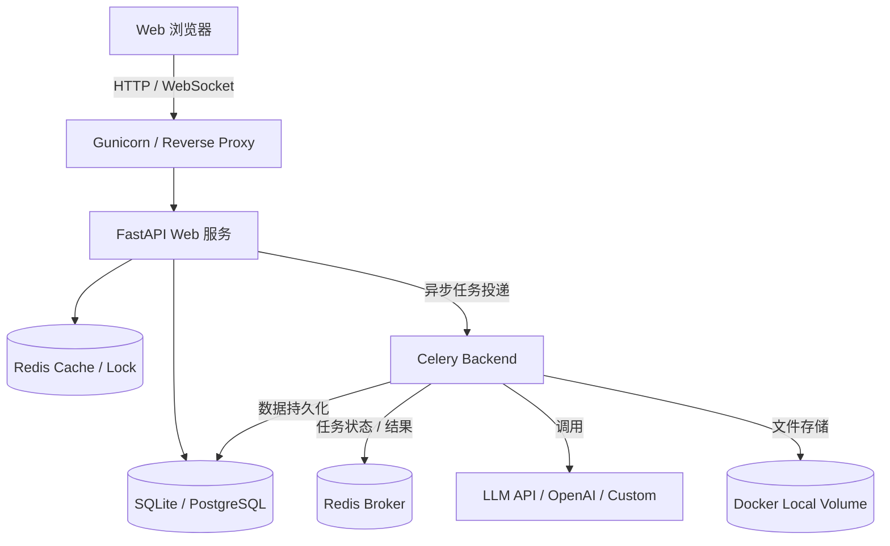
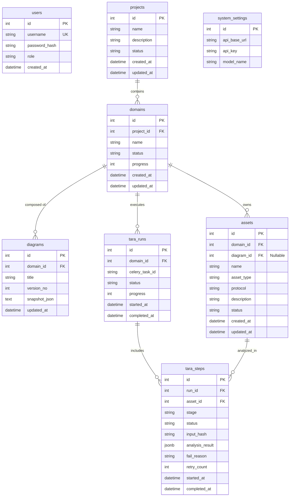
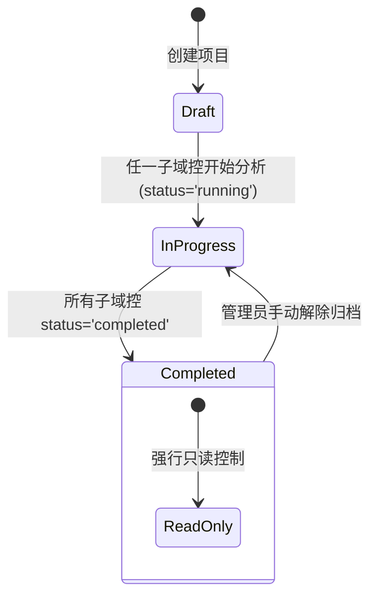
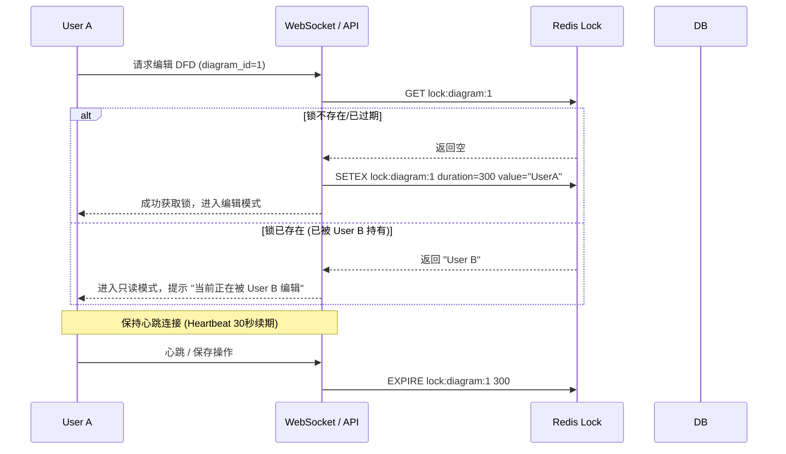
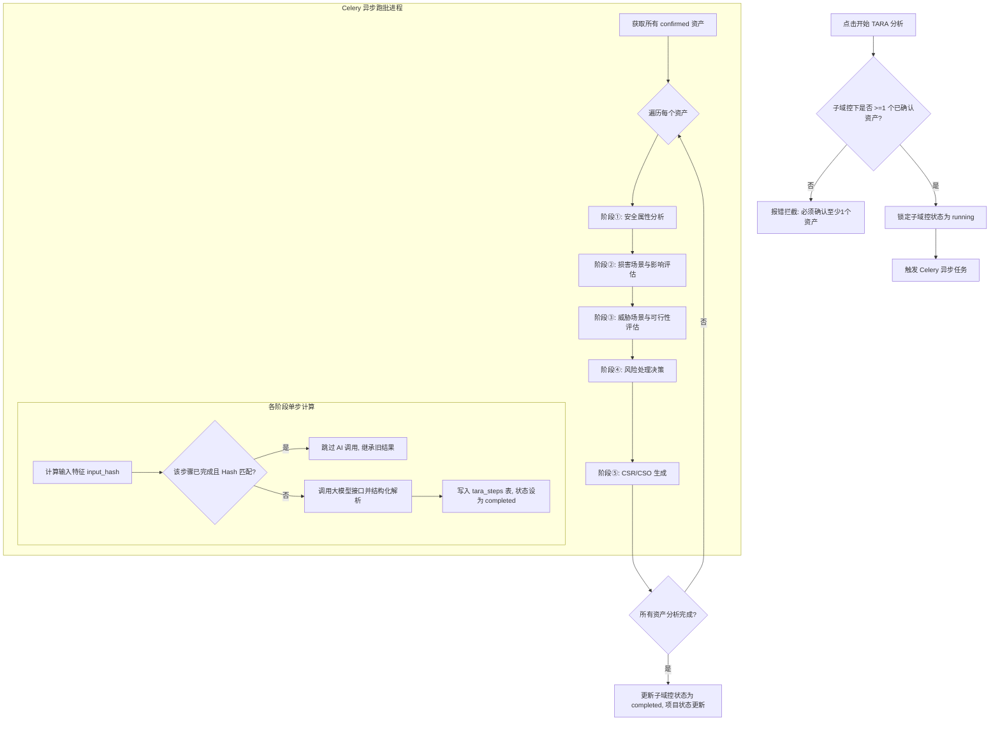

# TARA AI 平台系统设计文档

本文档定义了 **TARA AI 平台** 的系统架构、数据库设计、接口协议、核心业务逻辑实现机制及安全策略。本设计完全遵循并覆盖了项目需求规约的所有业务规则。

---

## 1. 系统架构总览 (System Architecture)

系统基于前后端分离架构，专为 10-20 人规模的内网/小团队高可用、易维护环境设计。



### 1.1 技术栈选型
*   **前端**：React 18 + Vite + Zustand (状态管理) + Tailwind CSS + React Flow (画布引擎) + CSS Modules。
*   **后端**：FastAPI (Python 3.10+)，提供高性能的 RESTful API 与轻量级 WebSocket。
*   **异步任务与缓存**：Celery + Redis。Redis 同时充当 Celery 消息代理、画布排他锁存储以及 WebSocket 状态同步介质。
*   **数据库**：PostgreSQL 或 SQLite（对于 10 人以内小团队，支持单个 SQLite 数据库以简化备份恢复，生产环境推荐 PostgreSQL）。
*   **模型调用与解析**：Pydantic (Pydantic v2) + Instructor / Strict JSON Schema，确保大模型输出绝对符合预定义的 JSON 结构。
*   **部署环境**：Docker Compose 单机或双机部署，报告存储于宿主机 Docker 挂载卷。

---

## 2. 数据库设计 (Database Schema Design)

包含 8 个核心业务实体表，并支持级联删除与乐观锁。



### 2.1 表结构详细定义

#### 2.1.1 用户账户表 `users`
存储系统操作人员账号，支持两级角色。
*   `id` (SERIAL PRIMARY KEY)
*   `username` (VARCHAR(50) UNIQUE NOT NULL)
*   `password_hash` (VARCHAR(255) NOT NULL)
*   `role` (VARCHAR(20) NOT NULL) - `admin` (系统管理员), `analyst` (安全分析员)
*   `created_at` (TIMESTAMP DEFAULT CURRENT_TIMESTAMP)

#### 2.1.2 项目表 `projects`
*   `id` (SERIAL PRIMARY KEY)
*   `name` (VARCHAR(50) NOT NULL)
*   `description` (VARCHAR(200))
*   `status` (VARCHAR(20) DEFAULT 'draft') - `draft` (草稿), `in_progress` (进行中), `completed` (已完成/归档)
*   `created_at` (TIMESTAMP DEFAULT CURRENT_TIMESTAMP)
*   `updated_at` (TIMESTAMP DEFAULT CURRENT_TIMESTAMP ON UPDATE)

#### 2.1.3 子域控表 `domains`
*   `id` (SERIAL PRIMARY KEY)
*   `project_id` (INT REFERENCES projects(id) ON DELETE CASCADE)
*   `name` (VARCHAR(50) NOT NULL)
*   `status` (VARCHAR(20) DEFAULT 'not_started') - `not_started` (未开始), `running` (分析中), `completed` (已完成), `failed` (分析失败)
*   `progress` (INT DEFAULT 0) - 0 至 100 整数
*   `created_at` (TIMESTAMP)
*   `updated_at` (TIMESTAMP)

#### 2.1.4 功能图表 `diagrams`
存储 React Flow 画布的节点、边数据，支持乐观锁版本校验。
*   `id` (SERIAL PRIMARY KEY)
*   `domain_id` (INT REFERENCES domains(id) ON DELETE CASCADE)
*   `title` (VARCHAR(100) NOT NULL)
*   `version_no` (INT DEFAULT 1 NOT NULL) - 乐观锁版本号
*   `snapshot_json` (TEXT NOT NULL) - 存储 React Flow 的节点与连线拓扑 JSON 数据
*   `updated_at` (TIMESTAMP)

#### 2.1.5 资产表 `assets`
*   `id` (SERIAL PRIMARY KEY)
*   `domain_id` (INT REFERENCES domains(id) ON DELETE CASCADE)
*   `diagram_id` (INT REFERENCES diagrams(id) ON DELETE CASCADE NULL) - 来源 DFD。若删除 DFD，关联资产级联清空或设置为待核对。若级联删除 DFD，将级联清除来源于该 DFD 的资产项。
*   `name` (VARCHAR(100) NOT NULL)
*   `asset_type` (VARCHAR(50) NOT NULL) - `data` (数据), `software` (软件), `hardware` (硬件), `communication` (通信)
*   `protocol` (VARCHAR(50)) - 使用的通信协议
*   `description` (TEXT) - 备注描述
*   `status` (VARCHAR(20) DEFAULT 'draft') - `draft` (待核对), `confirmed` (已确认), `rejected` (已拒绝)
*   `created_at` (TIMESTAMP)
*   `updated_at` (TIMESTAMP)

#### 2.1.6 TARA 运行记录表 `tara_runs`
*   `id` (SERIAL PRIMARY KEY)
*   `domain_id` (INT REFERENCES domains(id) ON DELETE CASCADE)
*   `celery_task_id` (VARCHAR(255) NULL) - Celery 后台任务的唯一 ID，用于强行中止任务
*   `status` (VARCHAR(20) DEFAULT 'pending') - `pending` (排队中), `running` (分析中), `completed` (已完成), `failed` (已失败), `cancelled` (已取消)
*   `progress` (INT DEFAULT 0)
*   `started_at` (TIMESTAMP)
*   `completed_at` (TIMESTAMP NULL)

#### 2.1.7 TARA 分析步骤表 `tara_steps`
存储 TARA 5 阶段中每个资产对应步骤的详细结论。
*   `id` (SERIAL PRIMARY KEY)
*   `run_id` (INT REFERENCES tara_runs(id) ON DELETE CASCADE)
*   `asset_id` (INT REFERENCES assets(id) ON DELETE CASCADE)
*   `stage` (VARCHAR(10) NOT NULL) - `stage1` 至 `stage5`
*   `status` (VARCHAR(20) DEFAULT 'pending') - `pending` (排队中), `running` (分析中), `completed` (已完成), `failed` (已失败)
*   `input_hash` (VARCHAR(64) NOT NULL) - 输入特征哈希（资产属性及前置依赖步骤的哈希），用于增量分析
*   `analysis_result` (JSONB NOT NULL) - 结构化 JSON 结论。格式：
    ```json
    {
      "ai_output": {},
      "is_human_modified": false,
      "modification_reason": "",
      "final_output": {}
    }
    ```
*   `fail_reason` (TEXT NULL)
*   `retry_count` (INT DEFAULT 0)
*   `started_at` (TIMESTAMP)
*   `completed_at` (TIMESTAMP)

#### 2.1.8 全局配置表 `system_settings`
*   `id` (SERIAL PRIMARY KEY)
*   `api_base_url` (VARCHAR(255) NOT NULL)
*   `api_key` (VARCHAR(255) NOT NULL)
*   `model_name` (VARCHAR(128) NOT NULL)

---

## 3. 核心业务逻辑设计 (Core Business Logic)

### 3.1 项目状态推导与归档控制 (BR-03, BR-78, BR-10)



*   **状态推导触发器**：
    在子域控的 `status` 发生变更时，通过数据库钩子或 API 业务层函数自动执行 `recalculate_project_status(project_id)`。
    ```python
    def recalculate_project_status(project_id):
        # 1. 查询所有子域控的状态
        domains = db.query(Domain).filter(Domain.project_id == project_id).all()
        statuses = [d.status for d in domains]
        
        # 2. 推导逻辑
        if "running" in statuses:
            new_status = "in_progress"
        elif len(statuses) > 0 and all(s == "completed" for s in statuses):
            new_status = "completed"
        else:
            new_status = "draft"
            
        # 3. 更新项目状态
        project = db.query(Project).get(project_id)
        if project.status != new_status:
            project.status = new_status
            db.commit()
    ```
*   **归档只读检查**：
    在所有写接口（如画布保存、资产确认、触发分析、结果修改等）中引入全局拦截器/中间件：
    ```python
    def check_project_not_completed(project_id):
        project = db.query(Project).get(project_id)
        if project and project.status == "completed":
            raise HTTPException(status_code=403, detail="该项目已完成并归档锁定，当前状态为只读。")
    ```
*   **运行期只读锁**：
    当子域控的 `status` 为 `running` 时，禁止任何 DFD 编辑、资产状态修改或重新触发分析。
    ```python
    def check_domain_not_running(domain_id):
        domain = db.query(Domain).get(domain_id)
        if domain and domain.status == "running":
            raise HTTPException(status_code=400, detail="当前子域控正在进行 TARA 分析，资产与画布已被锁定。")
    ```

### 3.2 功能图 (DFD) 并发保护与排他锁 (BR-16, BR-17, BR-72, BR-13)

为了防止多个用户同时编辑同一个域控的功能图或资产表导致冲突，设计了**编辑排他锁**与**画布乐观锁**。



*   **独占式编辑锁设计**：
    *   使用 Redis 存储排他锁，键为 `lock:domain:{domain_id}` 或 `lock:diagram:{diagram_id}`，值为 `{ "username": "张三", "timestamp": 1718239200 }`。
    *   有效期设为 5 分钟 (300 秒)。
    *   前端建立 WebSocket 长连接，每 30 秒发送一次心跳包以续期锁（`EXPIRE 300`）。
    *   如果用户主动离开页面或断开连接（如网络异常、关闭浏览器）超过 5 分钟，Redis 锁将自动过期释放。其他用户访问时，即可重新抢占该锁。
    *   **WebSocket 广播**：锁状态变更时（例如 User A 获得锁、心跳超时或离开释放锁），服务器向该域控 room 下的所有其他活跃 WebSocket 客户端广播 `LOCK_UPDATE` 消息，告知当前的编辑者姓名。非持有锁的客户端前端组件全部设为 `disabled` 只读状态。
*   **画布数据结构 (BR-13)**：
    `snapshot_json` 存储为严格的 React Flow 结构，节点和连线必须包含以下字段：
    *   **节点 (Nodes)** 结构：
        ```json
        {
          "id": "string",
          "type": "entity | process | storage | boundary",
          "position": { "x": "number", "y": "number" },
          "data": {
            "name": "string (名称, 必填)",
            "description": "string (功能描述)",
            "protocol": "string (协议)",
            "remarks": "string (备注)"
          }
        }
        ```
    *   **连线边 (Edges)** 结构：
        ```json
        {
          "id": "string",
          "source": "string (源节点 id)",
          "target": "string (目标节点 id)",
          "data": {
            "name": "string (连线名称)",
            "transmitted_info": "string (传输数据信息)"
          }
        }
        ```
*   **画布并发保存与乐观锁**：
    *   在 `diagrams` 表中设计 `version_no` 字段。
    *   前端保存画布（防抖 2 秒触发 `PUT /api/diagrams/:diagramId`）时，必须带上当前前端持有的 `version_no`。
    *   后端在执行 SQL 更新时进行乐观锁匹配：
        ```sql
        UPDATE diagrams 
        SET snapshot_json = :snapshot_json, version_no = version_no + 1, updated_at = NOW()
        WHERE id = :id AND version_no = :version_no;
        ```
    *   如果受影响行数为 0，说明数据库中版本已被抢先更新，返回 409 Conflict 错误。前端提示冲突并引导备份本地更改后刷新。
*   **本地容灾设计**：
    *   前端检测到网络中断时，不再向后端发送自动保存请求，而是将当前的 React Flow JSON 数据加密暂存在浏览器的 `LocalStorage` 中。
    *   网络恢复后，前端优先将 LocalStorage 里的暂存版本与服务端进行版本对比，确认无冲突后自动向服务器同步更新。

### 3.3 资产提取与 AI 去重机制 (BR-25, BR-29, BR-33, BR-35)

*   **自动提取资产 (DFD Parser)**：
    *   用户点击【收集资产】时，后端解析 `snapshot_json` 中的节点列表与连线列表。
    *   **节点与资产映射逻辑**：
        *   `type = "entity"`：映射为 `"hardware"`（硬件资产）。
        *   `type = "process"`：映射为 `"software"`（软件资产）。
        *   `type = "storage"`：映射为 `"data"`（数据资产）。
        *   `type = "interface"`：映射为 `"hardware"`（硬件资产）。专门代表串口、JTAG、USB等调试或物理层接口。
    *   **连线与资产映射**：`Edges` 映射为 `"communication"`（通信资产），并提取传输的协议字段作为协议属性。
    *   **更新保留逻辑**：
        1. 清空该 DFD 产生的、处于 `draft` (待核对) 状态的旧资产。
        2. 保留已被用户确认为 `confirmed` (已确认) 或 `rejected` (已拒绝) 的资产，即使这些资产在重新提取的画布中不再存在，以防丢失专家的历史修改记录。
*   **当前域控内的 AI 资产去重**：
    *   去重操作是局部范围的（仅针对单张资产汇总表，即**单个子域控内部**，不跨子域控）。
    *   **画布快照结合去重校验**：
        *   后端首先加载该子域控下各画布的 `snapshot_json`，并提取画布节点 ID 对应的 DFD 节点类型 (`type`)。
        *   在 AI 辅助去重和基于启发式规则过滤前，先对资产的 DFD 节点类型进行校验。
        *   **隔离原则**：如果两个资产在画布中的 DFD 节点类型不同（例如一个资产是 `entity` 实体，另一个资产是 `interface` 接口），系统直接过滤阻止其合并，并显式保留各自独立的状态，防止类似于控制器 `MCU` 与接口 `MCU_JTAG` 的错误去重。
    *   调用大模型时，将候选资产的详细信息和过滤规则传入，要求其识别拼写不同但实质相同的资产，并输出标准的 JSON 去重建议：
        ```json
        [
          {
            "keep_asset_id": 12,
            "remove_asset_ids": [15, 18],
            "reason": "命名存在冗余：'IVI_Bluetooth_Receiver' 与 'IVI_BT_Recv' 协议与功能描述完全一致，建议合并。"
          }
        ]
        ```
    *   去重确认执行时，被合并删除的资产其状态被更新为 `rejected`（已拒绝），并在备注中追加 `"[AI去重合并] 合并至资产ID: 12"`。这满足了保留历史轨迹的需求，而不是物理删除。

### 3.4 异步 TARA 分析引擎与增量跑批 (BR-36, BR-37, BR-40, BR-41, BR-45)



*   **输入特征哈希 (`input_hash`) 设计**：
    为了实现**增量分析与断点续跑**，每次执行某步骤前，计算其 `input_hash`。
    *   **阶段 ①** 的 `input_hash` 依赖于：`MD5(资产名称 + 资产类型 + 协议 + 备注)`。
    *   **阶段 ②** 的 `input_hash` 依赖于：`MD5(资产信息 + 阶段 ① 的最终结论)`。
    *   **阶段 ③** 的 `input_hash` 依赖于：`MD5(资产信息 + 阶段 ① & ② 的最终结论)`。
    *   **阶段 ④** 的 `input_hash` 依赖于：`MD5(资产信息 + 阶段 ① & ② & ③ 的最终结论)`。
    *   **阶段 ⑤** 的 `input_hash` 依赖于：`MD5(资产信息 + 阶段 ① & ② & ③ & ④ 的最终结论)`。
*   **增量匹配与断点续跑逻辑**：
    在执行某资产的第 `N` 阶段时：
    1. 计算当前最新输入参数的 `current_hash`。
    2. 查询上一次运行记录中，该资产在阶段 `N` 的 `tara_steps` 记录。
    3. 如果存在记录，且该记录状态为 `completed`，且 `input_hash == current_hash`，则**直接跳过**对 AI 大模型的接口调用。新运行记录中的对应 `tara_steps` 直接复制该旧步骤的结论，并将 `input_hash` 设为 `current_hash`。
    4. 只有当 Hash 不一致、或者该步骤先前失败了，系统才重新组装 Prompt 调用大模型。这大大节省了计算开销并缩短了运行时间。
*   **中止运行 (Cancel Run) 机制**：
    *   任务进展看板提供“取消运行”按钮，前端点击后发送 `POST /api/tara-runs/:id/cancel` 请求。
    *   后端通过查询 `tara_runs` 表中的 `celery_task_id`。
    *   调用 Celery API：`celery.current_app.control.revoke(task_id, terminate=True, signal="SIGTERM")` 强制杀掉后台分析进程。
    *   将该 `tara_run` 状态设为 `cancelled`，对应域控 `status` 重置为 `not_started`，进度重置为 `0`。

### 3.5 人工干预修改与继承逻辑 (BR-51, BR-75, BR-69, BR-67, BR-70)

*   **人工修改标记**：
    *   用户在结果审阅页面（页面 4）修改任何阶段的结论时，后端将该步骤的 `analysis_result` 中的 `is_human_modified` 标记设为 `true`，并将修改后的内容写入 `final_output`，同时记录 `modification_reason`。
*   **人工修改继承**：
    *   当发生“重新分析”时，在计算增量哈希时：如果系统检测到该资产该步骤上一次已经被“人工修改”（`is_human_modified == true`），且该资产的**基础属性及前置依赖步骤结论都没有发生改变**，那么在重跑时将直接**继承**此人工确认结论，避免用户的历史编辑工作被覆盖。
*   **风险决策联动**：
    *   在阶段 ④ (风险处理决策) 中，若决策（无论 AI 做出还是用户人工修改）被确定为 `"accept"` (接受风险) 或 `"transfer"` (转移风险)，则在执行第 ⑤ 阶段生成网络安全要求 (CSR) 时，引擎会解析前置阶段的决策。
    *   如果对应的威胁场景被决策免除，第 ⑤ 阶段将**跳过**为该威胁场景生成具体的 CSR 控制要求，实现了决策自动联动。
*   **多路径聚合与降级**：
    *   一个威胁场景可能有多条攻击路径。攻击可行性等级通常有：`Very High`, `High`, `Medium`, `Low`, `Very Low`。
    *   聚合规则：**木桶效应最高原则**。最终威胁可行性等级 = `Max(所有关联攻击路径的可行性等级)`。例如，两条路径可行性分别为 `Low` 和 `High`，则最终可行性取 `High`。
*   **脱网备用模式**：
    *   如果在分析过程中遇到 AI 故障或网络离线，系统提供备用手工创建接口。分析员可以直接在前端表单中手动填写损害场景、威胁场景、攻击可行性、风险处理决策 and CSR 结论，点击提交后直接将状态更新为 `completed`，无需依赖大模型调用。

### 3.6 报告导出与数据脱敏 (BR-57, BR-77)

*   **报告存储**：
    导出的 DOCX 和 XLSX 报告直接通过后端进程生成并写入宿主机 Docker 挂载的本地持久化卷目录 `/app/exports/`，不依赖 MinIO/S3，满足轻量化架构需求。
*   **数据脱敏导出选项**：
    当用户调用 `/api/exports/report?desensitize=true` 时，后端报表生成服务自动应用过滤规则：
    *   **常规报告**：输出资产、损害场景、威胁场景、全部关联攻击路径拓扑与步骤、脆弱性分析备注、风险值及最终 CSR。
    *   **脱敏报告**：过滤掉所有攻击路径分析的底层细节（如攻击步骤、攻击方法、利用的具体漏洞备注），仅保留最终提炼的安全需求（CSR）以及经过人工确认后的总体风险等级（Risk Level）。

### 3.7 AI 配置与结构化测试 (BR-59, BR-71)

*   **AI 接口配置**：
    支持在系统配置页面配置 `api_base_url`, `api_key` 和 `model_name`。
*   **结构化连通性测试 (Connectivity Test)**：
    *   当管理员在配置页面点击“测试连接”时，后端不仅发送一个简单的 `Ping` 请求，还会发送一个符合 TARA 格式的微型 Prompt 进行测试。
    *   测试 Prompt 规定返回符合特定 Schema（例如包含 `test_success: boolean`, `message: string`）的标准 JSON 结构。
    *   后端解析该 JSON 响应。如果大模型输出的 JSON 结构损坏或不符合 Schema 约束，测试接口将显式报错并给出建议，从而确保配置后的模型能够胜任后续强结构化的 TARA 输出解析工作。

### 3.8 系统管理与多用户 (BR-64, BR-65, BR-66)

*   **用户两级权限**：
    *   `admin` (系统管理员)：具有配置大模型、解锁已被归档冻结的项目、执行数据备份与恢复的完整权限。
    *   `analyst` (安全分析员)：常规业务操作，仅对未归档的项目执行画布绘制、资产核对、启动 TARA 及修改分析结果。
*   **一键数据备份与恢复工具 (CLI Tool)**：
    *   系统提供一个 Python 脚本工具 `manage.py backup` and `manage.py restore`。
    *   `backup`：导出数据库数据（如果使用 SQLite 直接复制数据库文件，如果使用 PostgreSQL 执行 pg_dump）及 Docker Volume 目录下的文件，并打包成一个 `.tar.gz` 压缩包。
    *   `restore`：清理当前数据库及文件，并基于备份的压缩包进行原子恢复，确保系统在故障时能秒级重建。

---

## 4. 前端架构与页面结构设计 (Frontend Architecture & Page Layout)

前端采用 React 18 与 Vite 构建，利用 Zustand 进行全局状态切片管理，并对画布节点进行封装。

### 4.1 全局状态管理 (Zustand Stores)

前端由 3 个核心 Store 分离关注点：
1.  **`projectStore`**：管理当前项目列表、当前选定项目、子域控树状结构、各域控任务分析进度看板。
2.  **`canvasStore`**：管理 React Flow 画布的节点、连线、当前的乐观锁版本 `version_no`，以及编辑排他锁持有状态。处理自动保存的 2 秒防抖以及离线 `LocalStorage` 自动写入/同步。
3.  **`taraStore`**：管理当前域控 TARA 细节表的审阅状态、安全控制矩阵（CSR/CSO 汇总），以及报告导出配置。

### 4.2 路由与页面布局结构

系统采用 SPA 路由，页面详细映射如下：

```
[Route /] -> 页面 1 (项目管理主页)
               |
               v
[Route /projects/:id] -> 页面 2 (项目工作台)
                           |
                           +---> [Route /projects/:id/domains/:domainId/dfd/:dfdId] -> 页面 3 (DFD 编辑器)
                           |
                           +---> [Route /projects/:id/domains/:domainId/results] -> 页面 4 (TARA 结果页)
                           |
                           +---> [Route /settings] -> 系统配置页面
```

#### 4.2.1 页面 1：项目创建与管理页面 (主页)
*   **网格视图**：以毛玻璃卡片渲染历史项目，右上角带状态标签（`草稿` / `进行中` / `已完成`）。
*   **前端搜索**：输入框防抖（Debounce 300ms），对卡片列表的 `name` 和 `description` 进行模糊过滤。
*   **新建项目模态框**：毛玻璃背景。包含必填表单 `name`（限制 50 字符）和选填表单 `description`（限制 200 字符）。

#### 4.2.2 页面 2：项目工作台与资产分析页面 (项目详情页)
*   **左侧导航栏**：
    *   “新建域控”按钮：点击并输入名称（限制 50 字符）创建，成功后唤起引导模态框，提供 `[继续创建域控]` 与 `[开始 DFD 分析]` 两个跳转按钮。
    *   域控树状列表：树形展示。点击展开特定域控并加载其下属的功能 DFD 列表。
    *   分析任务进展看板：显示各域控分析进度条（0-100%）与状态。若状态为 `running`，在进度条旁提供红色的“取消运行”按钮，点击后发送中止指令。
*   **右侧工作区**：
    *   功能 DFD 列表卡片网格，提供“+ 创建新功能 DFD”按钮。
    *   域控汇总资产表：聚合该域控下所有 DFD 提取出的资产，展示字段包括 ID、名称、资产类型（数据/软件/硬件）、来源 DFD 名称、确认状态（下拉选择：待核对/已确认/已拒绝）。
    *   “AI 资产去重”与“开始 TARA 分析”控制条。

#### 4.2.3 页面 3：DFD 拓扑绘图编辑器页面 (Stride 画布)
*   **左侧栏**：显示当前域控内的功能 DFD 列表（支持就地双击改名、点击垃圾桶执行级联删除），下方为拖拽元素箱（外部实体、处理过程、数据存储、物理边界）。
*   **中间区 (画布)**：React Flow 主体，实现滚轮缩放、拖拽布局。支持点击节点/连线拉伸 Edge-resize，并弹出属性抽屉（编辑名称、描述、协议、传输的数据信息）。
*   **右侧 AI 助手栏**：
    *   包含对话记录区。
    *   **AI 画图**按钮：点击后，**前端首先清空当前画布**，然后将输入 prompt 投递至 `/api/diagrams/:id/ai-generate`。后端利用 LLM 解析生成规范的拓扑节点（包含自适应布局坐标 position）并返回，前端接收后渲染至画布上，并触发 version_no 自增的自动保存。
*   **动作逻辑**：包含【收集资产】按钮和【返回工作台】按钮。

#### 4.2.4 页面 4：TARA 结果审阅与项目级汇总页面
*   **TARA 细节表**：展示已分析的损害场景、威胁场景、攻击可行性及风险处理决策（支持逐项核对、修改和输入理由）。
*   **项目级汇总视图 (Consolidated CSR View)**：多维矩阵卡片。自动梳理本项目下所有域控生成的网络安全要求 (CSR) 和网络安全目标 (CSO)，提供完整的系统安全控制矩阵。
*   **报告导出面板**：勾选“常规”/“脱敏”选项，一键导出至宿主机 Docker 挂载卷。

---

## 5. 关键 API 接口设计 (Key API Endpoints)

### 5.1 项目与域控管理

*   **`POST /api/projects`**：创建项目
    *   *Payload*: `{ "name": "项目A", "description": "描述..." }`
*   **`GET /api/projects`**：模糊搜索与列表
    *   *Query*: `?q=xxx`
*   **`POST /api/projects/:id/archive`**：项目归档（管理员权限）
*   **`POST /api/projects/:id/unarchive`**：项目解除归档（管理员权限）
*   **`POST /api/domains/:domain_id/cancel-run`**：取消后台运行的 TARA 分析任务

### 5.2 功能图与编辑锁

*   **`PUT /api/diagrams/:id`**：保存画布（包含乐观锁控制）
    *   *Payload*: `{ "version_no": 5, "snapshot_json": "{...}" }`
    *   *Response (409 Conflict)*: `{ "detail": "画布已被其他成员更新，请刷新。" }`
*   **`POST /api/diagrams/:id/lock`**：尝试获取独占编辑锁
    *   *Payload*: `{ "username": "张三" }`
    *   *Response (200)*: `{ "success": true, "locked_by": "张三" }`
    *   *Response (423 Locked)*: `{ "success": false, "locked_by": "李四" }`
*   **`POST /api/diagrams/:id/ai-generate`**：AI 画图拓扑生成接口

### 5.3 资产管理与 AI 去重

*   **`POST /api/domains/:domain_id/extract-assets`**：自动从所有画布提取资产
*   **`POST /api/domains/:domain_id/deduplicate`**：触发域控内 AI 去重
    *   *Response*: 返回合并建议列表（ID 映射与去重理由）
*   **`POST /api/assets/:id/confirm`**：确认或拒绝资产
    *   *Payload*: `{ "status": "confirmed" | "rejected" }`

### 5.4 TARA 分析引擎

*   **`POST /api/domains/:domain_id/tara-runs`**：启动 TARA 分析
    *   *Constraint*: 校验至少包含一个状态为 `confirmed` 的资产。
*   **`GET /api/domains/:domain_id/tara-runs/progress`**：查询分析进度与状态

---

## 6. 安全性与并发控制设计 (Security & Concurrency Control)

1.  **用户密码安全**：所有密码使用 `bcrypt` 算法进行加密哈希存储，拒绝明文保存。
2.  **API 鉴权**：采用 JWT (JSON Web Tokens) 作为无状态身份验证机制，Token 有效期 2 小时，敏感操作（如系统配置、备份恢复、归档解锁）限定 `admin` 角色。
3.  **防止超卖/过载**：大模型调用接口通过 Celery Worker 的 `concurrency` 进行流控限制，避免过载导致模型服务限流（Rate Limit Exceeded）。

---
